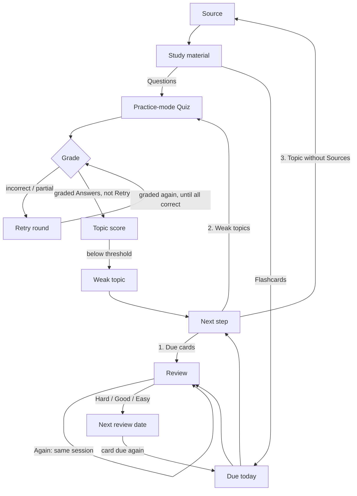

# Practice loop

How every Answer decides what the Student practices next (CAP-7 to CAP-11). Illustrated version: `../../../docs/figurer/ovingssloyfen.svg` (PNG beside it).

```mermaid
graph TD
  Source --> SM[Study material]
  SM -->|Questions| Quiz[Practice-mode Quiz]
  SM -->|Flashcards| Due[Due today]
  Quiz --> Grade{Grade}
  Grade -->|incorrect / partial| Retry[Retry round]
  Retry -->|graded again, until all correct| Grade
  Grade -->|graded Answers, not Retry| Score[Topic score]
  Score -->|below threshold| Weak[Weak topic]
  Due --> Review
  Review -->|Again: same session| Review
  Review -->|Hard / Good / Easy| Date[Next review date]
  Date -->|card due again| Due
  Due --> Next[Next step]
  Weak --> Next
  Next -->|1. Due cards| Review
  Next -->|2. Weak topics| Quiz
  Next -->|3. Topic without Sources| Source
```
